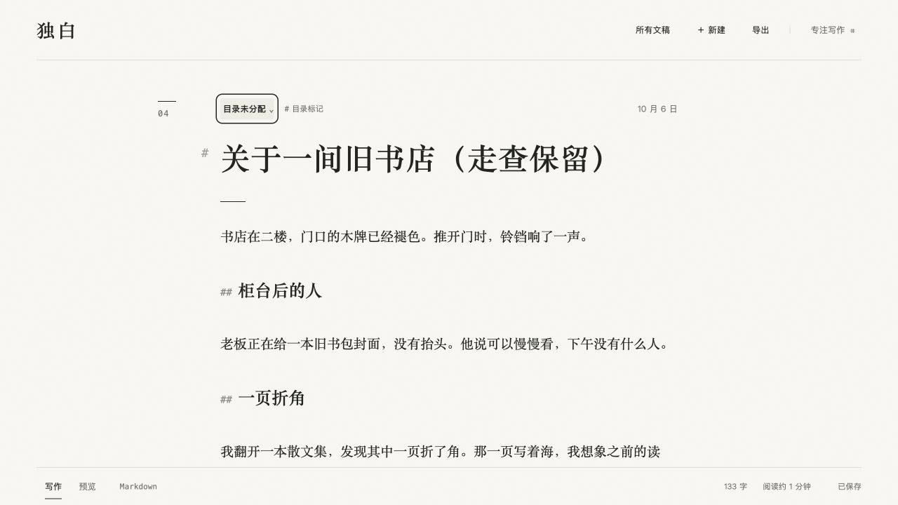
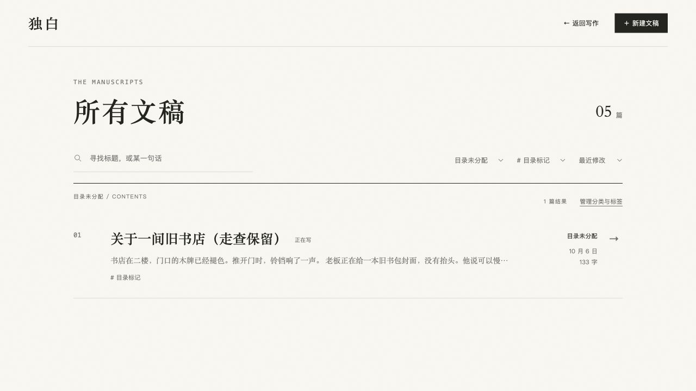

# 页息：分类与标签独立任务走查

走查日期：2026-10-06。入口：`http://127.0.0.1:4173/design/writing/solo.html?state=welcome`。使用 CUA 隐藏临时标签页，保持默认桌面视口；没有阅读源码、修改实现、启动其他 agent 或评分。所有变更发生在该页面的独立内存示例数据中。临时标签页已关闭，未修改浏览器 viewport。

## 实际路径与结果

| 任务 | 实际点击与视图切换 | 观察结果 |
| --- | --- | --- |
| 为欢迎文稿新建分类 | 写作页点击「指南」→「整理文稿」分类页→输入「走查·片刻」→「＋ 创建」 | 原「指南」取消选中，新分类立即选中，显示「已创建分类：走查·片刻」和「已保存」。 |
| 创建两个标签并移除一个 | 同一弹层切换「标签」→分别输入并创建「晨光走查」「暂留走查」→再次点击「# 暂留走查」→「完成」 | 两个新标签创建后均立即选中；再次点击后「暂留走查」取消选中。写作页只显示「编辑标签：晨光走查」。移除指解除本篇分配，目录中的「暂留走查」仍存在，后续显示 0 篇。 |
| 通过新分类和新标签找回 | 「所有文稿」→分类筛选「走查·片刻」→标签筛选「# 晨光走查」→打开唯一结果 | 显示「1 篇结果」，结果为「欢迎来到页息」，分类与标签一致；打开后仍显示这两个项目，正文未变。 |
| 目录中创建未分配项目 | 返回「所有文稿」→「管理分类与标签」→创建「目录未分配」→切换标签→创建「目录标记」 | 管理弹层名称为「分类与标签」，说明为「创建后，可以在文稿中使用，也可以在这里筛选」。两项创建后均显示 0 篇，不自动分配给正在写的欢迎文稿。 |
| 对其他文章使用全局项目 | 「完成」→清除仍保留的分类与标签筛选→打开「关于一间旧书店」→点击「随笔」→选择「目录未分配」→切换标签→选择「# 目录标记」→Esc | 此篇原分类「随笔」取消选中，新的分类与标签选中；关闭后写作页显示二者。最后返回目录，组合筛选这两个项目，仅显示该篇，1 篇结果。 |
| 已有标签名重复创建 | 目录管理标签页输入「日常」→「＋ 创建」 | 显示「已使用已有标签」；名称输入清空；目录仍只有一个「# 日常」，仍显示 1 篇，没有重复项目。 |
| Esc 与焦点 | 文章整理弹层标签页输入未提交名称→从输入框起连续按 14 次 Tab→Esc | 14 次焦点均落在 dialog 内：创建→完成→关闭→分类→标签→六个标签→输入→创建→完成；未落到被遮住的写作页面。Esc 关闭，焦点返回文章分类按钮。 |
| 关闭后输入保留 | 在文章标题追加「（走查保留）」→打开分类弹层→Esc→观察文章标题与正文 | 标题输入仍为「关于一间旧书店（走查保留）」，正文仍在，显示已保存。 |

## 卡住、走错与犹豫

没有被任务流程卡住，也没有误打开其他文稿。文章分类按钮可直接进入整理弹层，「再点一次即可移除」的提示与标签点击结果一致。

一次需要处理的视图状态是：从欢迎文稿回到目录时，之前选中的「走查·片刻」和「# 晨光走查」仍保留，目录只显示欢迎文稿。要打开另一篇文章，必须分别切回「全部分类」和「全部标签」。这没有阻断任务，但增加了两次筛选选择。

目录创建与文章创建的区别能从实际结果识别：目录新建项目显示 0 篇；文章内新建项目立即选中。目录里的复用提示「已使用已有标签」容易让人短暂考虑是否分配了该标签，不过本次目录计数保持不变，且没有重复。

另外观察到一个输入边界：在整理弹层的新标签名称输入框输入「未提交走查」，Esc 关闭后，再通过文章的标签按钮打开，输入框恢复为空。这段未提交名称没有保留；文稿标题输入保留。本次报告明确区分这两种输入，不将未提交名称清空等同于文稿丢失。

「完成」和 Esc 关闭瞬间，AX 快照有时还包含弹层退出过程的节点，同时主页面恢复、焦点已归还；随后的正常操作与观察中弹层消失，没有操作阻塞。这里只记录所见，不据此推断实现。

## 验证边界

本任务只验证当前打开页面中的创建、分配、取消分配、筛选、复用、键盘焦点与关闭后文稿输入保留。`state=welcome` 为独立内存数据；没有重新加载、关闭重开或跨标签页验证持久化，也没有据「已保存」文案宣称真实持久化成功。真实保存与重载应由主执行者在独立端口另验。

## 截图

文章分类、标签及关闭后标题输入：

全局项目分配后的组合筛选结果：

