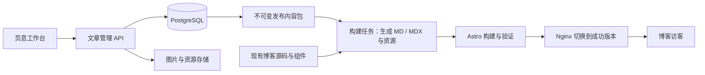

# 页息 PageHush · 个人博客文章工作台规划

日期：2026-10-06。2026-10-09 更新：首页画廊、访问码认证、文章编辑、封面入库、分类整理、文章目录与封面转场已进入正式实现；MDX 完整验收和发布链路仍未接入。历史设计原型与过程产物已从当前工作区移除，需要追溯时查看 Git 历史。后续进展见第 13 节。

## 1. 产品定位与已确定的要求

为 Yohoia 的 Astro 个人博客制作文章：写作、组织、管理图片、预览、发布，并确认博客已经显示目标版本。

- 首版面向一个作者、一个博客，不引入多用户账号体系；使用单人访问码和服务器会话保护工作台。
- 沿用第一版「页息」设计：暖白纸面、黑色文字、文学与设计杂志气质，写作占据主要空间。
- 文章源内容必须保留 Markdown / MDX，不以生成 HTML 或编辑器内部 JSON 代替源文件。
- 每篇文章可选一个分类、多个标签；作者可以手动创建、重命名、整理。
- 必须支持 MDX / 组件、数学公式、代码高亮、Mermaid 图、图片说明。
- 数据库保存文章与管理数据，对象存储保存图片等二进制资源；用户倾向部署在阿里云服务器。
- 对象存储已由用户确定为 MinIO 社区版，通过 Docker 镜像部署到阿里云服务器；不以开通付费 OSS 为开发前提。
- 按「功能 → 技术栈 → 基础框架 → 根据设计稿制作页面 → 博客对接 → 云端部署」推进。
- 编辑器已确定采用 Tiptap 开源版，搭建 Markdown 编辑器；MDX、Mermaid 与图注适配仍进入首版验收。选型记录见[编辑器方案](editor-options.md)，版本与兼容性见[技术基线](tech-stack.md)。

## 2. 现有项目与博客的实际情况

正式基础框架位于 `packages/`，分为 web、api、worker 与 shared。当前界面源码、交互测试和视觉样式以工作区实现为准；早期静态原型与过程产物不再随仓库维护，其决策保留在文档和 Git 历史中。

博客位于 `/Users/yohoia/Desktop/blog`。此次只读取配置、约定和相关源码，没有修改博客。

| 项目     | 源码中看到的情况                                                                                  | 对工作台的影响                                           |
| -------- | ------------------------------------------------------------------------------------------------- | -------------------------------------------------------- |
| 输出模式 | `astro.config.mjs` 为 `output: 'static'`                                                          | 首版继续静态构建与发布                                   |
| 内容来源 | `src/content.config.ts` 用 glob 读取 `src/content/blog/**/*.{md,mdx}`                             | 可在构建前从数据库导出内容包，再沿用原有读取方式         |
| 组件     | 已接入 `@astrojs/mdx` 与 React；有 `ArticleCallout.astro`                                         | 正式组件预览应使用博客自己的 Astro 渲染链路              |
| 公式     | remark-math + rehype-katex；详情引入 KaTeX 样式                                                   | 平台与博客使用一致的公式规则                             |
| 代码     | Shiki，github-light / github-dark                                                                 | 预览遵循同一代码语言与主题配置                           |
| Mermaid  | 所读配置与文章功能中未发现接入                                                                    | 需要同时加入平台预览与博客渲染                           |
| 图片     | 当前两篇文章使用相对路径本地图片，封面使用 Astro image schema                                     | 导入时要迁移相对资源；发布适配需要处理封面类型与图片优化 |
| 元信息   | title、description、draft、publishedAt、updatedAt、tags、language、author、topic、cover、coverAlt | 使用明确字段映射，不换掉旧文章的 URL 和日期              |
| 路径     | 通过 `entry.id` 生成，支持嵌套目录；有中文与 `/en` 路由                                           | 保存原始路径；语言与翻译关系独立管理，不自动翻译         |
| 已有文章 | 机器学习概述、KNN算法                                                                             | 用真实内容检验导入、公式、代码和图片迁移                 |
| 部署     | 文档注明尚未部署，已有 Nginx 错误页配置                                                           | 阿里云部署仍是后续工作，不能记为已上线                   |

版本以博客锁文件与安装环境为准。其 package.json 当前声明 Astro `^7.3.5`、React `^19.3.0`，本规划不要求为对接而升级博客。

## 3. 首版功能范围

首版完成后，可以从平台完成一篇含公式、图表、代码、图片和组件的文章，并可靠发布到现有博客。

| 模块       | 首版需要实现                                                                    | 验收结果                                                   |
| ---------- | ------------------------------------------------------------------------------- | ---------------------------------------------------------- |
| 写作       | 新建、标题与正文编辑、Markdown/MDX 格式标识、快捷操作、专注模式、目录与字数     | 任意内容保存、重开后源文本完整；中文输入正常               |
| 自动保存   | 云端自动保存、保存反馈、失败重试、本地未同步恢复、多标签页冲突提示              | 断网不丢输入；不同设备编辑不会静默覆盖较新版本             |
| 文稿目录   | 搜索、分页、分类/标签/状态组合筛选、排序、继续写作、回收站与恢复                | 能找回草稿、已发布文章和有未发布修改的文章                 |
| 分类与标签 | 创建、重命名、去重、分配、移除；删除分类前迁移或设为未分类                      | 不存在悬空关联；重命名不破坏文章路径                       |
| 文章资料   | 摘要、slug/路径、分类、标签、语言、发布时间、封面、替代文本、图注；高级字段保留 | 与现有 blogSchema 对接，既有元信息不丢失                   |
| 专业内容   | 公式、代码高亮、Mermaid、图片说明、MDX 导入与组件源代码                         | 所有要求进入首版验收，不退化为普通 Markdown                |
| 图片与资源 | 选择/粘贴/拖拽上传、进度与失败重试、插入图片、alt 与 caption、引用查询          | 发布后链接稳定；正文不保存会过期的上传签名 URL             |
| 预览       | 快速内容预览；使用现有 Astro 主题的完整预览，含 MDX/组件                        | 快速预览不冒充最终博客效果；完整预览不公开草稿             |
| 导入导出   | MD/MDX 与 frontmatter 导入、批量导入资源、路径映射预检；单篇/整库导出           | 原格式、组件语法、额外字段与资源关联可追溯                 |
| 版本记录   | 定期检查点、发布快照、查看/恢复旧版本                                           | 恢复先成为新草稿，再由作者发布；自动保存不每次复制整篇历史 |
| 发布       | 发布检查、首次发布、更新、撤回、失败重试、发布记录、打开线上文章                | 草稿与线上版本分离；实际部署成功才显示博客已生效           |
| 配置       | 无独立设置页面；数据库、对象存储、博客与发布凭据由服务端环境配置和部署文件承载  | 连接密钥不在前端保存                                       |
| 数据保障   | 数据库备份、图片/资源备份、恢复说明与一次恢复演练                               | 迁出平台可以拿回文章；同一服务器上的副本不算异地备份       |

首版不包含多人协作、多站点运营、AI 写作、评论/访问统计、双向 Git 同步、定时发布和全文检索服务。后续有实际需求再扩展。博客已有 Project / Skill 不属于此次文章管理范围。

撤回已发布文章也需要重新生成博客；移入回收站不会偷偷撤回线上文章。界面必须说明当前线上版本是否仍可访问。

## 4. 编辑器的要求，先于具体选型

下一步比较成熟编辑器时，以实际内容测试以下要求，而不是只比较工具栏外观：

1. Markdown / MDX 原文可以保真往返，包括 import/export、JSX 属性、表达式和嵌套组件。
2. 数学公式、代码、Mermaid 与图片说明不被转换或删除。
3. 中文输入法、撤销、长文章、图片粘贴、异步保存与冲突恢复可靠。
4. 可以把既定纸面排版应用到正文，工具栏和组件插入不占据写作主视图。
5. 组件能够按博客配置提供插入入口与参数提示；组件实现仍留在博客代码仓库。
6. 无法可视化编辑的语法保留为源码，不静默降级。即使选择所见即所得方案，也需要可靠的源码入口。
7. 编辑器负责编辑；Astro 负责正式 MDX 编译和博客效果。React 编辑器不能直接渲染 `.astro` 组件。

早期原型中的 CodeMirror 5 和 marked 只用于方案探索，不作为正式编辑器与最终渲染器。正式编辑器采用 Tiptap 开源版；上述内容保真测试是接入验收，不因选库而取消。Tiptap 的结构化编辑状态是派生结果，数据库继续保存 Markdown / MDX 源文本。

## 5. 数据和发布规则

### 内容真源

数据库是文章内容的唯一管理真源。源文本单独保存为 text，明确 `format = md | mdx`；元信息结构化保存，未知 frontmatter 字段保留在 JSONB 中。编辑器内部状态与生成 HTML 都是派生结果。

迁入后，文章编辑以平台为准。博客组件、模板、主题仍以博客仓库为准；首版不同时接受平台与本地文章文件的双向修改。导出到构建目录的文章是可重建产物。

### 草稿与已发布版本

- 自动保存只更新工作稿。已发布文章再次编辑时，显示「有未发布修改」，线上旧版继续存在。
- 发布操作锁定一份不可变文章快照，并创建包含全部公开文章的站点版本（release）。
- 同一次构建读取同一个 release，避免列表、正文、标签索引在构建期间读取不同版本。
- 完整 release 还记录博客源码版本与内容渲染配置版本，便于重现组件和样式。
- 发布作业成功后记录 `liveReleaseId`；收到触发请求或构建开始都不算线上生效。
- 作业串行执行，带唯一请求标识和重试记录；旧作业回调不能覆盖较新的成功版本。
- 失败保留当前线上产物，工作稿与候选快照都可找回。重试明确是重试原快照还是重新发布最新稿。
- 分类/标签改名只改变管理与工作稿数据；已发布快照中的名称在重新发布后更新。批量更新相关公开文章是明确操作。
- 发布后的 slug 默认保持稳定；如需修改，必须同时生成旧地址跳转，避免旧链接失效。

### 保存状态

服务器返回版本号，提交时带上编辑起点版本。版本冲突时保留本地输入并展示比较/恢复选择，不用后提交的请求静默覆盖旧版本。本地恢复副本按工作台实例和文章隔离，云端确认前不清除，旧响应也不能把新输入标为已保存。

## 6. 推荐的 Astro 对接方式

### 首版：数据库内容 → 固定内容包 → Astro 静态构建



用户不需要手动复制文件。构建任务通过服务端只读接口取得数据库里的文章快照，自动物化为构建工作区中的 `.md` / `.mdx`；Astro 再使用现有 glob + MDX 集成读取。图片从资源清单取得并映射到工作区，或输出稳定资源地址。

采用这条路线的理由是当前博客是静态站点，并且需要真实 Astro / React 组件。官方 [MDX 集成](https://docs.astro.build/en/guides/integrations-guide/mdx/) 支持在本地 MDX 使用这些组件；由正常博客构建链编译比平台另做一套 MDX 执行器更能保持一致。

普通 Markdown 可以采用 [自定义远程 Content Loader](https://docs.astro.build/en/reference/content-loader-reference/)，但不能把「远程 Markdown 字符串渲染」等同于现有任意 MDX/组件的编译。为了首版统一处理 MD 与 MDX，先采用内容包方式。

### 与“让 Astro 读取数据库”的关系

这是构建时读取数据库内容，通过接口隔离数据库结构。并不是访客每打开一篇文章就请求数据库。首版博客仍可以在工作台服务暂时不可用时正常提供已发布文章。

如果未来明确要求保存后即时展示，才评估 SSR / Live Collections 和运行时 MDX 组件方案。[Astro 提供实时内容集合](https://docs.astro.build/en/guides/content-collections/)，但改为实时查询意味着博客运行时依赖内容服务，也不能自动解决 MDX 编译。本次不为这项设想改动现有静态输出。

### 当前博客的适配清单

- 标题等字段映射到现有 schema；工作台摘要映射 `description`，分类先映射现有 `topic`，标签映射 `tags`。
- 路径保存现有 `entry.id` 结构，不依据标题重新生成旧文 URL。
- 导入两篇真实文章及相对引用图片，记录资源哈希与重写结果，保留原始文件备份。
- `cover` 当前是本地 Astro image：首版优先在构建工作区物化封面图片，保持原有优化；如改远程封面，要同步调整 schema、尺寸与允许域名，不能直接替换字段值就声称兼容。
- 现有相对组件导入要保持目录语义；可逐步规范为博客别名。组件文件进入源码管理，文章只保存引用与参数。
- 增加 Mermaid 和正文 figure/figcaption 的一致渲染，区分图片 alt 与可见 caption。
- 只替换 blog 的内容来源；projects、skills 等集合保持现有来源。
- 首页文章列表、Blog 列表、详情、双语路径、RSS（公开端点尚待补齐）和 Sitemap 从同一发布版本生成并过滤草稿。

## 7. 技术栈建议

以下是面向现有博客与单人维护的技术基线；编辑器已选 Tiptap 开源版。具体版本、兼容性证据与待验证事项以[技术基线](tech-stack.md)为准，搭建时使用固定版本与锁文件。

| 层       | 推荐                                                           | 原因与边界                                                                                                                             |
| -------- | -------------------------------------------------------------- | -------------------------------------------------------------------------------------------------------------------------------------- |
| 平台前端 | React 19 + TypeScript + Vite + React Router                    | 博客已有 React；便于评估成熟编辑器及复用适合两端的 React 组件。管理应用按 SPA 部署                                                     |
| 编辑器   | Tiptap 开源版 + 官方 Markdown 扩展                             | 所需扩展统一版本；补充 MDX、Mermaid、图注与原文保留机制                                                                                |
| 页面样式 | Tailwind CSS 4.3.3 + CSS 设计变量 / 局部样式                   | 与现有博客样式技术一致，以页息设计稿为基线                                                                                             |
| 图标     | Lucide React 1.48.0                                            | 延续博客的 SVG 线性图标，按需导入，调整描边以适合纸面界面                                                                              |
| 字体     | Fontsource 可变字体包 5.3.0，自托管                            | 正文 Noto Serif SC / Newsreader，界面 Noto Sans SC / Geist，代码 Geist Mono；具体分工与加载方式见技术基线                              |
| 管理 API | Node.js 24 LTS + Fastify + TypeScript                          | 与博客保持同一运行时，提供文章、媒体、预览与发布接口；[Fastify 支持 TypeScript](https://fastify.dev/docs/latest/Reference/TypeScript/) |
| 数据库   | PostgreSQL 18，若现有环境已用受支持的 17 则复用                | 存文本、关系、版本、任务与设置；[官方支持周期](https://www.postgresql.org/support/versioning/) 可查，不先引入独立搜索服务              |
| 数据访问 | Drizzle ORM + pg + SQL 迁移                                    | 类型化查询，保留数据库约束与事务；[迁移文件进入版本管理](https://orm.drizzle.team/docs/migrations)，生产不自动随意改表                 |
| 接口契约 | JSON Schema / TypeBox，接口版本 `/v1`                          | 请求与响应均验证；平台、构建器与博客通过明确契约对接                                                                                   |
| 使用方式 | 单人工作台，无登录/注册/会话模块                               | 直接进入编辑器，服务连接凭据只在服务端使用                                                                                             |
| 内容处理 | unified / remark / rehype；复用博客的 KaTeX、Shiki 与 MDX 配置 | 普通预览复用规则，组件完整效果由 Astro 构建；[remark 为插件化 Markdown 处理器](https://github.com/remarkjs/remark)                     |
| 代码高亮 | 编辑器、预览和博客统一 Shiki 4.4.3                             | 共用主题、语言与别名；Tiptap CodeBlock 的编辑高亮适配另行实现                                                                          |
| Mermaid  | Mermaid，预览和博客使用相同版本与配置                          | 错误指向对应代码块；[官方使用说明](https://mermaid.js.org/config/usage.html) 提供渲染接口。首版选浏览器按需渲染，静态 SVG 可后续增强   |
| 对象存储 | MinIO 社区版，用户已选定                                       | 从 Docker 镜像拉取并部署到 ECS，通过 StorageAdapter 调用；部署阶段确认可拉取的社区版标签和 digest 并固定版本                           |
| 后台任务 | PostgreSQL 持久化任务表 + 独立 Node worker                     | 预览/发布任务可恢复、串行、重试；首版不需要 Redis                                                                                      |
| 构建     | 现有 Astro + 固定博客源码 + 隔离工作目录/容器                  | MDX 是可执行内容，不在管理 API 进程中执行；构建容器不持有管理数据库和部署主机的广泛权限                                                |
| 部署     | Docker Compose + Nginx + HTTPS，阿里云 ECS                     | 前端与博客为静态产物；API、worker 和数据库在服务端运行                                                                                 |
| 验证     | 类型检查、lint、Vitest + API/数据库集成测试 + Playwright       | 重点验证内容保真、冲突、导入和发布流程，不为纯装饰建立重复测试                                                                         |

[Node.js 24 属于 LTS 版本线](https://nodejs.org/en/about/previous-releases)。包管理统一 npm，与现有博客约定一致。

### 存储的具体取舍

对象存储已确定为 MinIO 社区版，由用户于 2026-10-06 明确选择，通过 Docker 镜像部署。单机部署结构与其他候选留档见[自建对象存储方案](self-hosted-storage.md)。具体镜像标签和 digest 在部署阶段核实，不默认使用 `latest`，也不替换为 AIStor。服务器配置暂时未知，尚未部署或测量资源占用。

用户尚未购买阿里云 OSS，因此本规划调整为优先免费自建，不要求先购买存储服务。ECS 可以通过 Docker 运行对象存储，与应用和 PostgreSQL 共同部署；实际资源分配在了解服务器配置后确定。数据库记录媒体 ID、对象键、大小、类型、尺寸、哈希、引用关系与说明。

用户进一步关心 R2 对上传、预览和发布的网络影响。当前建议优先把图片原件与对象存储放在阿里云 ECS，平台和构建任务通过同机内部连接读取；R2 保留为托管备选，不作为首版上传与发布的必要依赖。若服务器在中国内地且主要读者也在国内，这条链路更符合当前访问需求，但实际加载速度仍需按地域、公网带宽、图片大小和并发量验证。

此前比较中的“原件在 R2、发布图片在 ECS”方案，读者本来也是从 ECS 加载图片。改为 ECS 存原件，主要收益在于减少上传、管理预览与发布对外部存储网络的依赖，不意味着读者速度会自动再提升一档。对象存储产品不代替图片压缩、响应式尺寸和缓存；首版继续由 Astro 生成优化资源并让 Nginx 提供公开产物。

自建软件免费不代表服务器资源免费：图片使用 ECS 的磁盘与公网带宽，容量和访问性能受现有服务器限制；单节点存储没有跨机器冗余，需要独立备份。阿里云 OSS 则是托管服务，自建 S3 兼容服务可以承担本平台的对象存储职责，但不是在 ECS 中安装阿里云 OSS 产品。

截至 2026-10-06 的选型记录（其他产品仅作比较留档）：

| 候选              | 免费与部署情况                                                                                                                                                             | 对本项目的判断                                                                                       |
| ----------------- | -------------------------------------------------------------------------------------------------------------------------------------------------------------------------- | ---------------------------------------------------------------------------------------------------- |
| MinIO 社区版      | 自建 S3 对象存储；部署时核对社区版镜像标签、架构与 digest，见[官方仓库](https://github.com/minio/minio)                                                                    | 用户已选定，通过 Docker 镜像拉取部署                                                                 |
| Garage            | AGPLv3 开源；官方提供 Docker 与单节点配置，见[官方仓库](https://github.com/deuxfleurs-org/garage)和[快速开始](https://garagehq.deuxfleurs.fr/documentation/quick-start/)   | 比较留档，偏向小规模自托管；不是完整 S3 实现                                                         |
| SeaweedFS 开源版  | Apache-2.0；官方仓库提供单节点 `weed mini` 和 Docker 部署，见[官方仓库](https://github.com/seaweedfs/seaweedfs)                                                            | 备选，提供对象与文件存储等更广功能。评估时使用开源版，不混淆另外收费的企业版                         |
| MinIO AIStor Free | 提供免费单节点许可和官方容器，见[容器部署说明](https://docs.min.io/aistor/installation/container/install/)                                                                 | 想继续使用 MinIO 时的候选；需要申请许可证，免费许可限制为单节点，不是旧开源社区版                    |
| Cloudflare R2     | 托管 S3 兼容服务，Standard 存储有每月 10 GB-month、100 万次 Class A、1000 万次 Class B 免费额度，出口流量不收费，见[价格页](https://developers.cloudflare.com/r2/pricing/) | 不想维护存储服务时的备选；超过免费额度会计费，不能视为无限免费。使用前测量本地与目标服务器的访问效果 |

MinIO 社区版与 AIStor Free 是不同的选型，本项目按用户选择采用社区版。社区版仓库的归档状态见[官方仓库](https://github.com/minio/minio)；镜像可用性和运行验证留到部署阶段。AIStor Free 的单节点许可信息仅作比较留档，见[官方产品页面](https://www.min.io/pricing)。

Garage 支持所需的基本 S3 操作，但没有标准 S3 ACL/Bucket Policy 和对象版本控制，采用自己的权限管理，见[兼容性清单](https://garagehq.deuxfleurs.fr/documentation/reference-manual/s3-compatibility/)。文章历史由 PostgreSQL 管理；图片使用不可变对象键与资源引用，不依赖存储供应商的对象版本功能。接入前验证上传、签名 URL、读取、删除、跨域与持久化，不能仅凭“兼容 S3”声称所有功能可用。

StorageAdapter 暴露 upload、read、delete、签名上传与资源定位等操作，首版围绕所需 S3 能力实现，供应商配置与权限管理单独处理。以后迁移需要复制对象、校验并切换资源定位，不能只修改 endpoint。OSS 与 S3 也只部分兼容，[阿里云文档列出差异](https://help.aliyun.com/zh/oss/developer-reference/compatibility-with-amazon-s3)；若以后开通 OSS，再加入官方 SDK 适配。

MinIO 配置与对象数据放在持久化卷中，重建容器不丢图片。官方快速示例不直接当作生产配置；部署阶段补齐 HTTPS、访问控制、磁盘余量监测和异机备份。当前没有部署或测试容器。

默认私有写入。草稿资源使用受保护的预览读取或构建工作区资源；只把已发布资源纳入公开产物/公开资源访问。原始文件、备份与草稿不随公开资源一起开放。发布产物可以包含图片，避免博客页面访问必须依赖管理 API。

## 8. 数据实体与接口边界

| 实体                             | 主要职责                                                     |
| -------------------------------- | ------------------------------------------------------------ |
| articles                         | 工作稿正文、format、元信息、路径、版本号、分类、回收状态     |
| categories / tags / article_tags | 一个分类、多标签以及唯一名称约束                             |
| article_revisions                | 检查点、发布快照、对应完整元信息与资源清单                   |
| assets / article_assets          | 对象键、类型/尺寸/哈希、状态以及版本资源引用                 |
| blog_connections                 | 博客地址、源码版本设置、组件清单、字段映射；密钥在服务端保管 |
| releases / release_entries       | 不可变的站点版本及每篇文章的目标快照                         |
| jobs / deployment_attempts       | 预览、发布、重试、作业状态、失败原因、线上生效版本           |

自动保存版本号与历史快照不同。分类/标签展示名与文章 slug 也不同。发布快照保留完整正文、元信息及资源引用，不只保留一个状态字段。

管理接口涵盖 articles、taxonomy、assets、revisions、previews、releases 和连接设置；当前工作台已由单人访问码与服务器会话保护。构建消费接口仅返回指定 release 的内容包，服务凭据限定只读和对应用途；不返回管理字段、其他草稿或数据库凭据。

## 9. 页面规划：沿用页息视觉基线补足任务

| 页面/区域       | 内容与入口                                                                             |
| --------------- | -------------------------------------------------------------------------------------- |
| 默认编辑器      | 沿用纸面主视图，欢迎语、恢复上次文章、新建、目录；补自动保存和发布状态                 |
| 文章资料侧面板  | 摘要、路径、封面、分类标签、语言、日期；写作时收起                                     |
| 内容工具        | 公式、代码、Mermaid、图片说明、组件插入；按需出现，保留源码编辑                        |
| 预览            | 快速预览与“博客预览”明确区分；完整预览指向具体稿件版本                                 |
| 所有文稿        | 沿用杂志篇目排列，增加状态筛选、未发布修改提示、回收站入口                             |
| 分类与标签      | 扩充现有整理窗口，加入重命名、引用计数与迁移处理                                       |
| 图片/资源选择器 | 以选择、插入为主；素材库管理独立，不挤占编辑正文                                       |
| 发布检查窗口    | 标题/路径/摘要/资源/组件校验、预览版本、确认发布、失败定位                             |
| 历史与发布记录  | 正文版本比较、恢复为草稿、线上版本及重试记录                                           |
| 配置            | 无独立设置页面；服务器、存储、博客与备份配置进入部署与环境变量，必要时在诊断日志中验证 |

没有重新选择视觉方向。第一版只覆盖部分交互，新增发布与资料区还需要基于实际页面设计和走查；规划不等于这些页面已经实现。

## 10. 实施顺序与里程碑

| 阶段              | 工作                                                                     | 完成条件                                           |
| ----------------- | ------------------------------------------------------------------------ | -------------------------------------------------- |
| 0：范围与决策     | 本规划；讨论成熟编辑器；确定内容格式、组件规则与技术基线                 | 用真实文章验证编辑器不会丢失要求的内容             |
| 1：基础框架       | 前端/API、数据库迁移、文章 CRUD、环境配置与本地运行                      | 直接进入编辑器，真实文章保存数据库，刷新重新读取   |
| 2：工作台         | 根据第一版设计组件化，目录/分类标签、自动保存/冲突、上传、资料、导入导出 | 从欢迎编辑器走到文章和资源管理，内容保真           |
| 3：Astro 完整链路 | 内容包、MDX/组件、公式/代码/Mermaid/图注、私人博客预览、发布任务与快照   | 含全部内容类型的文章成功构建；草稿不会进入公开产物 |
| 4：阿里云上线     | 按服务器资源确定部署配置、域名/HTTPS、数据库、OSS、Nginx、备份           | 真实博客更新与撤回、构建失败保旧版、恢复演练通过   |

优先做一篇文章的完整闭环，再扩展管理页面，不先搭建没有真实用途的复杂服务。阶段 1–3 可本地运行，不需要为了开始开发立即安装云端服务。

当前仓库结构：

```text
packages/web/              React 工作台与文章界面
packages/api/              Fastify 管理接口、Drizzle schema 与迁移
packages/worker/           预览与发布任务
packages/shared/           内容与 API 契约
tests/e2e/                 Playwright 浏览器测试
docs/                      规划、技术基线与部署说明
assets/                    README 图片与公开说明素材
scripts/                   开发、构建、部署与数据脚本
```

设计过程产物、走查证据和第三方原型依赖不进入当前仓库；发布适配与部署目录在对应阶段实现时再补充。

现有 `/Users/yohoia/Desktop/blog` 继续独立管理博客主题与组件。工作台框架不吞并或覆盖博客仓库。

## 11. 首版验收清单

1. 导入现有两篇文章，原有标题、日期、路径、公式、代码与图片得到保留。
2. 另用受控测试文章覆盖 MDX 的 Astro/React 组件、Mermaid 和图注；测试数据不进入正式公开博客。
3. 含复杂内容的文章，编辑 → 保存 → 重新读取 → 导出，源内容无损；编辑器切换不破坏未知语法。
4. 多标签页保存冲突、断网编辑重连、上传失败可恢复，不丢原文。
5. 已发布文章修改但未重新发布时，线上内容保持原版本。
6. 同一 release 生成首页、列表、正文和元信息；成功后线上确认该 release。
7. 构建失败、重复请求、worker 重启、旧作业回调，不能覆盖线上较新成功版本。
8. 撤回、旧地址跳转、版本恢复、资源引用及回收操作不造成意外断链。
9. 工作台访问入口符合个人使用方式；公开博客产物不包含草稿、管理数据或服务凭据。
10. 完成数据库与资源备份恢复，确认整库导出可以迁出平台。

## 12. 下一步仍需确定

- 编辑器已选 Tiptap 开源版；后续验证 MDX 的原文保留、扩展内容与源码流程，不再重新选择编辑器。
- 首批组件清单：现有 ArticleCallout 与需要新增的文章组件；组件代码由博客仓库管理。
- 阿里云服务器资源、域名和部署目录：进入云端部署阶段再核对，不影响当前功能范围。
- 首版所列发布方式为推荐方案；若用户要求 Astro 每次访问实时读库，需要另行调整运行时与 MDX 方案。

## 13. 2026-10-08 实施进展

本节记录规划后的最新实现状态，覆盖此前“本轮产物只有规划文档”的结论。

已实现：

- npm workspaces 基础框架继续按 `web`、`api`、`worker`、`shared` 组织。
- 首页提供文章画廊、分类筛选、动态计数、卡片动画和滚动后新建入口。
- 文章编辑页接入 Tiptap Simple Editor，提供标题、分类、标签、封面占位与全屏写作。
- 分类支持创建、选择和删除；文章、分类、标签与资源记录已写入 PostgreSQL，封面已上传到 MinIO 私有桶。
- 前端布局拆分为 `EditorLayout` 与 `SimpleEditor`，降低页面布局和编辑器实现的耦合。
- 项目已建立类型检查、ESLint、Prettier、Vitest、Playwright E2E 和生产构建检查。

仍未实现：

- PostgreSQL 数据模型、文章 CRUD、自动保存与版本冲突处理。
- MinIO 上传、对象键管理、素材库与持久化封面。
- Markdown / MDX 源文本保存、真实博客构建和发布链路。
- 完整 MDX 保真验收、公式 / Mermaid / 图注 / 博客组件适配。
- 服务器部署、Nginx 切换、备份与恢复。
