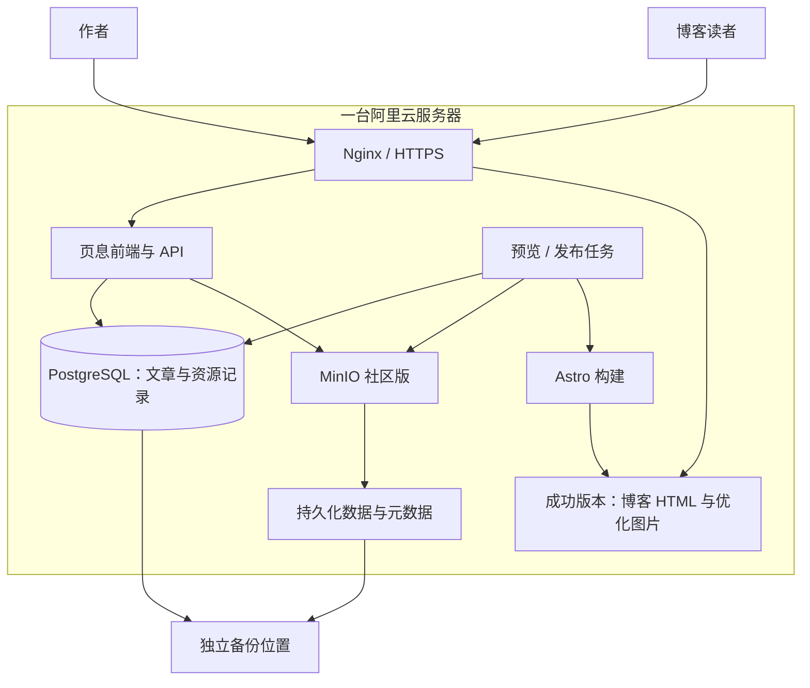

# 自建对象存储方案

2026-10-06。适用项目：页息个人博客文章工作台，连接现有 Astro 博客。用户优先自建，服务器地域、CPU、内存、磁盘和公网带宽暂时未知。

当前决定：用户已选定 **MinIO 社区版，通过 Docker 镜像拉取部署**。部署阶段核实可拉取的社区版镜像标签、服务器架构和 digest，固定版本；不替换为 AIStor Free。尚未拉取镜像、安装服务或连接云端服务器。

本文保留其他候选的比较资料，部署结构按 MinIO 社区版执行。

## 1. 需要解决的任务

首版主要保存文章图片与原件：上传、读取、删除、列出资源、签名上传/下载、按文章版本追踪资源。数据库保存正文和元信息；对象存储不承担文章历史管理。

对象存储、平台和构建任务优先部署到同一台阿里云 ECS。应用通过容器内部网络访问存储，公开访问由 HTTPS 入口管理。实际加载速度仍由服务器地域、带宽、缓存和图片大小决定，选一个存储软件不自动获得 CDN 加速。

## 2. 其他候选比较留档

| 方案                 | 首版部署方式                             | 管理方式                        | 主要取舍                                         | 推荐位置                       |
| -------------------- | ---------------------------------------- | ------------------------------- | ------------------------------------------------ | ------------------------------ |
| A：Garage            | 单节点 Docker 服务，持久化数据和元数据   | CLI / API；按需接第三方浏览工具 | 专注常用 S3 能力；权限管理方式与完整 S3 不同     | 小规模自托管候选，当前未选用   |
| B：SeaweedFS 开源版  | Docker 单节点 mini，把需要的模块集中运行 | 自带管理界面，配合 S3 客户端    | 功能更广，需要理解不同模块与数据/元数据的关系    | 需要更多资源管理能力时优先比较 |
| C：MinIO AIStor Free | 官方 Docker 容器，单计算节点与持久化数据 | 自带 Console + S3 客户端        | 需要申请并维护有效免费许可；不是旧社区开源版     | 偏好 MinIO 操作体系时选择      |
| D：RustFS            | 官方 Docker 单节点，持久化数据和日志     | 自带 Web Console                | 已有正式版，但 GA 历史较短；单盘升级拓扑涉及迁移 | 第二梯队验证候选               |

### A：Garage——保持存储层简单

官方定位为小到中规模的自托管 S3 服务，以单一二进制提供服务；项目为 AGPLv3 开源。见[官方项目](https://github.com/deuxfleurs-org/garage)。

[官方快速开始](https://garagehq.deuxfleurs.fr/documentation/quick-start/)提供 Docker 与单节点配置。数据目录和元数据目录都要做持久化；不能直接使用未挂载数据卷的试运行示例。

适合页息的原因：平台自己会提供素材选择和插入界面，日常不依赖对象存储的额外后台。基础上传/下载和签名 URL 足够支撑首版。

限制：[官方兼容性清单](https://garagehq.deuxfleurs.fr/documentation/reference-manual/s3-compatibility/)明确不实现标准 S3 ACL / Bucket Policy 和对象版本控制，使用自身权限机制。文章版本用 PostgreSQL 保存；图片每次替换产生新对象键，保留旧文章快照所引用的旧图片。

管理：日常操作在页息完成，部署人员用 CLI/API 管桶和密钥；若需要独立浏览工具，按[官方列出的浏览工具](https://garagehq.deuxfleurs.fr/documentation/connect/cli/)另行选择，不预装额外界面服务。

### B：SeaweedFS 开源版——功能扩展空间更大

开源版使用 Apache-2.0。官方提供 `weed mini` 与 Docker 单节点入口，同一进程组合 master、volume、filer、S3 等模块，并提供管理界面。见[官方仓库与快速开始](https://github.com/seaweedfs/seaweedfs)。

适合页息的原因：以 S3 接口接入，后续如果还需要文件目录访问等能力，已有扩展空间。首版只使用对象存储职责，不启用数据湖等无关业务。

取舍：运行在一个容器不等于没有模块区别，需要明确原始对象与元数据的备份、升级和恢复方法。具体管理界面能覆盖哪些桶/对象操作，在试用时确认。

首版采用单节点 mini，不直接搭建多节点分布式集群。使用开源版镜像，不混用另外提供的 Enterprise 产品。

### C：MinIO AIStor Free——采用 MinIO 官方产品

[官方容器部署说明](https://docs.min.io/aistor/installation/container/install/)提供镜像、Console 与许可证接入；免费许可覆盖单个计算节点，可使用一个或多个磁盘，免费许可不包含支持。

适合页息的原因：Console、桶与 S3 客户端构成完整的管理方式。愿意申请许可证，且想采用 MinIO 操作体系时，这是当前对应的方案。

取舍：AIStor 是带许可的产品，部署前核对当时的免费许可条件与版本，不能把“免费”理解为旧社区开源版继续维护。

MinIO 社区版仓库状态见[官方仓库](https://github.com/minio/minio)。本项目已选社区版，AIStor Free 仅作比较资料；其许可证与容器说明不作为社区版的部署依据。

### D：RustFS——保留为可验证的新备选

RustFS 使用 Apache-2.0，提供 S3 接口、Docker 单节点与 Web Console，见[官方仓库](https://github.com/rustfs/rustfs)。官方在 2026-09-16 宣布 1.0.0 GA，见[正式版公告](https://www.rustfs.com/blog/announcing-rustfs-1-0-0-ga/)。

把它列为备选是因为正式版发布时间较近，不用厂商性能宣传代替实际验证。尤其要检查上传/签名兼容、重启持久化与恢复。

官方仓库说明单节点单盘不能原地扩展为多盘 Pool；需要新建部署并通过 S3 迁移。因此未来扩容需作为明确迁移工作规划，而不是承诺只加一个目录就完成。

## 3. 其他方案的适用场景（留档）

- 只有个人博客文章图片，日常操作主要在页息中完成：Garage 可以作为小规模自托管候选。
- 希望同时得到更广的文件存储能力和管理界面：优先比较 B，SeaweedFS 开源版。
- 已熟悉 MinIO，重视其 Console，接受申请免费许可：选 C，AIStor Free。
- 希望试用有 Web Console 的新开源方案：D 可评估，先完成验证再决定。

目前不依据未知服务器配置强行给出内存占用排序，也不声称某方案必然更快。对个人博客来说，维护方式、实际需要的 S3 功能和恢复是否可靠，比吞吐宣传更有决策价值。

## 4. 公共部署结构

对象存储负责原件；Astro 负责构建公开文章与优化图片；Nginx 提供成功版本的静态文件。正式图片访问不必经过管理 API。

构建任务读取同机存储中的固定文章版本，上传和管理预览也不依赖 R2。仍需正常的互联网连接提供作者上传和读者访问，存储软件不消除 ECS 公网带宽限制。

数据库、应用与 MinIO 分别运行。单节点按没有跨主机冗余设计；不把同一服务器上的多个容器记为高可用。

## 5. 首版资源组织

- 文章正文、分类标签、图注与引用关系在 PostgreSQL。
- 原件以不可变对象键存储，例如 `originals/<asset-id>/<content-hash>.<ext>`，原文件名只是展示信息。
- 相同内容可以按哈希去重；换图创建新对象，不覆盖旧版本图片。
- 草稿原件保持私有，通过工作台预览入口或短期签名访问；数据库和 Markdown 不保存会过期的签名链接。工作台不设置用户登录模块，存储签名仍由服务端生成。
- 发布快照锁定资源 ID 与哈希，构建时物化成 Astro 可读取的图片路径。
- 图片生成响应式尺寸与优化格式，发布到独立静态目录；不向公开博客输出原件管理接口。
- 回收资源前检查工作稿、文章历史和发布版本的引用，按保留策略清理。

存储供应商只通过 StorageAdapter 接入平台。上传、读取、删除、列表、签名 URL 与路径定位分别验证；供应商特有的桶和权限设置不假定可以通用。

## 6. 单机资源未知时的实施策略

当前用户暂不清楚服务器配置，因此先做框架设计，进入存储接入阶段再验证 MinIO，不要求先购买或升级服务器。

部署前读取地域、CPU、内存、可用磁盘、磁盘类型、公网带宽与已有服务。预算需要同时覆盖应用、数据库、对象存储、原件、预览产物、旧发布版本及备份暂存，不能把存储软件的最低要求当作整个项目要求。

预览和发布构建默认串行执行，并限制资源使用。如果服务器不适合同时承担 Astro 构建，再选择独立构建环境；不是先承诺一台机器能容纳所有服务。

## 7. 选定后的落地工作

1. 核实可拉取的 MinIO 社区版镜像标签、架构与 digest，在本地启动固定版本容器并验证 SDK 操作；不使用不受控的 `latest` 自动更新生产。
2. 验证中文文件名、对象键、图片类型、签名 URL、错误处理、删除与引用追踪。
3. 上传图片后重建容器，确认对象与元数据仍在；完成独立备份和恢复，确认重新读取的哈希一致。
4. 对接平台素材管理和 Astro 内容包，用真实文章验证图片优化与预览。
5. 核对服务器资源后生成具体 Compose、卷目录、HTTPS 入口与运行说明。
6. 在云端实测上传、预览、构建与读者图片访问，再上线首个完整文章流程。

正式部署配置会覆盖持久化、权限和访问入口：存储管理界面仅供管理员访问，公开入口只提供所需资源，不把所有内部端口暴露到互联网。

## 8. 当前结论

自建方向与产品已确定：MinIO 社区版，通过 Docker 镜像拉取部署。具体镜像版本留待部署阶段核实，当前仍未安装服务。

2026-10-08 更新：文章编辑页的封面已通过 Fastify 上传到 MinIO 私有桶，并在 PostgreSQL `assets` 表登记对象键、哈希与元信息；编辑器通过 API 代理读取私有对象。发布快照、响应式资源生成与公开资源复制仍未实现。
